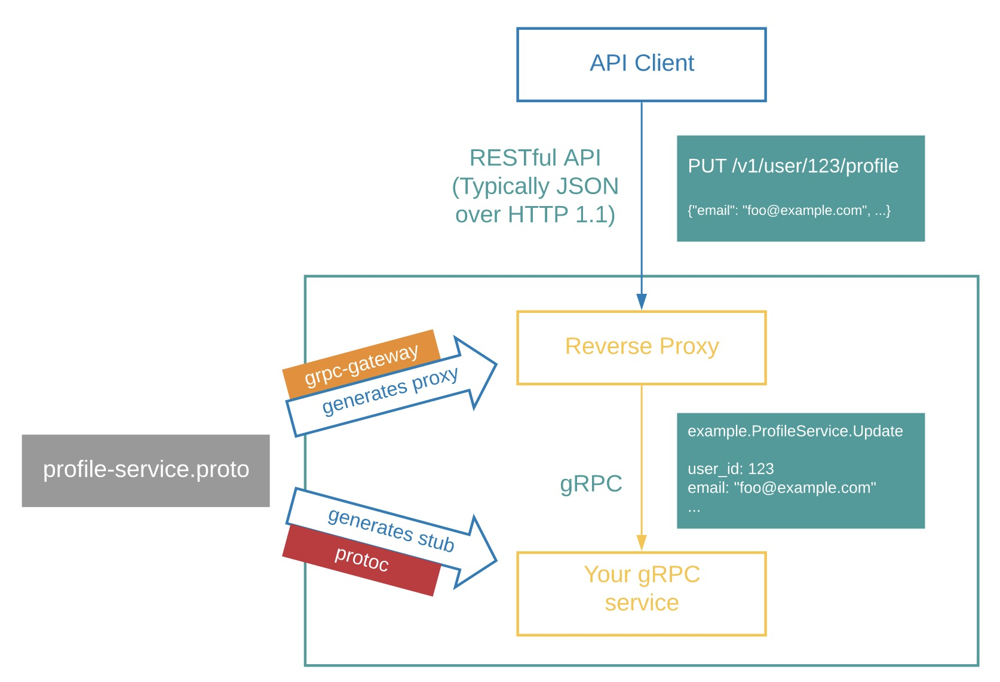

# rs-rpc
rust grpc microservices in action project https://github.com/daheige/rs-rpc

# rust grpc crate
tonic https://crates.io/crates/tonic

# grpc client support
- rust grpc采用tokio,tonic,tonic-build 和 prost 代码生成，进行构建
- grpc客户端支持go,nodejs,rust等不同语言调用服务端程序
- 支持http gateway模式（http json请求到网关层后，转换为pb message，然后发起grpc service调用

# centos7 install protoc
    1、下载https://github.com/protocolbuffers/protobuf/archive/v3.15.8.tar.gz
        cd /usr/local/src
        sudo wget https://github.com/protocolbuffers/protobuf/archive/v3.15.8.tar.gz

    2、开始安装
        sudo mv v3.15.8.tar.gz protobuf-3.15.8.tar.gz
        sudo tar zxvf protobuf-3.15.8.tar.gz
        cd protobuf-3.15.8
        sudo yum install gcc-c++ cmake libtool
        # 对于ubuntu系统 sudo apt install gcc cmake make libtool
        $ sudo mkdir /usr/local/protobuf

        需要编译, 在新版的 PB 源码中，是不包含 .configure 文件的，需要生成
        此时先执行 sudo ./autogen.sh 
        脚本说明如下:
        # Run this script to generate the configure script and other files that will
        # be included in the distribution. These files are not checked in because they
        # are automatically generated.

        此时生成了 .configure 文件，可以开始编译了
        sudo ./configure --prefix=/usr/local/protobuf
        sudo make && make install

        安装完成后,查看版本:
        $ cd /usr/local/protobuf/bin
        $ ./protoc --version
        libprotoc 3.15.8
        
        建立软链接
        $ sudo ln -s /usr/local/protobuf/bin/protoc /usr/bin/protoc
        $ sudo chmod +x /usr/bin/protoc

# mac install protoc
```shell
brew install automake
brew install libtool
brew install protobuf
```

# create a rust grpc project
```shell
   cargo new rs-rpc
```

1. 新建src/client.rs
```rust
fn main() {}
```

2. 在src同级目录新建build.rs文件，添加如下内容：
```rust
use std::ffi::OsStr;
use std::fs;
use std::io::Write;
use std::path::Path;

fn main() -> Result<(), Box<dyn std::error::Error>> {
    // 推荐下面的方式生成grpc rust代码
    // 完成下面的步骤后，在main.rs中添加 mod rust_grpc;
    // 1.读取proto目录下的*.proto
    let proto_dir = "proto"; // proto文件所在目录
    let mut file_list = Vec::new();
    let lists = Path::new(proto_dir)
        .read_dir()
        .expect("read proto dir failed");
    for entry_path in lists {
        if entry_path.as_ref().unwrap().path().is_file() {
            file_list.push(entry_path.unwrap().path())
        }
    }

    let rust_grpc_dir = "src/rust_grpc"; // 存放grpc rust代码生成的目录
    let _ = fs::create_dir(rust_grpc_dir); // 创建目录

    // 2.生成rust grpc代码
    // 指定rust grpc 代码生成的目录
    tonic_build::configure()
        .out_dir(rust_grpc_dir)
        .compile(&file_list, &[proto_dir])?;

    // 3.生成mod.rs文件
    // 用下面的rust方式生成mod.rs
    // 拓展名是proto的文件名写入mod.rs中，作为pub mod xxx;导出模块
    let ext: Option<&OsStr> = Some(&OsStr::new("proto"));
    let mut mod_file = fs::OpenOptions::new()
        .write(true)
        .create(true)
        .open(rust_grpc_dir.to_string() + "/mod.rs")
        .expect("create mod.rs failed");
    let header = String::from("// @generated by tonic-build.Do not edit it!!!\n");
    let _ = mod_file.write(header.as_bytes());
    for file in &file_list.iter().next() {
        if file.extension().eq(&ext) {
            if let Some(file) = file.file_name() {
                let filename = file.to_str().unwrap().replace(".proto", "");
                println!("current filename: {}", filename);
                let _ = mod_file.write(format!("pub mod {};\n", filename).as_bytes());
            }
        }
    }

    Ok(())
}
```

3. 添加依赖
```toml
[[bin]]
name = "rs-rpc-client"
path = "src/client.rs"

[dependencies]
tonic = "0.8.0"
prost = "0.11.0"
tokio = {version = "1",features = ["full"]}

[build-dependencies]
tonic-build = "0.8.0"
```
4. cargo run --bin rs-rpc
   这一步就会安装好所有的依赖，并构建proto/hello.proto

5. 在src/main.rs中添加rust grpc server代码
```rust
use rust_grpc::hello::greeter_service_server::{GreeterService, GreeterServiceServer};
use rust_grpc::hello::{HelloReply, HelloReq};

use tonic::{transport::Server, Request, Response, Status};

/// 定义grpc代码生成的包名
mod rust_grpc;

/// 实现hello.proto 接口服务
#[derive(Debug, Default)]
pub struct GreeterImpl {}

#[tonic::async_trait]
impl GreeterService for GreeterImpl {
   // 实现async_hello方法
   async fn say_hello(&self, request: Request<HelloReq>) -> Result<Response<HelloReply>, Status> {
      // 获取request pb message
      let req = &request.into_inner();
      println!("got request.id:{}", req.id);
      println!("got request.name:{}", req.name);
      let reply = HelloReply {
         message: format!("hello,{}",req.name),
         name: format!("{}", req.name).into(),
      };

      Ok(Response::new(reply))
   }
}

/// 采用 tokio 运行时来跑grpc server
#[tokio::main]
async fn main() -> Result<(), Box<dyn std::error::Error>> {
   let address = "127.0.0.1:8081".parse()?;
   println!("grpc server run:{}", address);

   let greeter = GreeterImpl::default();
   Server::builder()
           .add_service(GreeterServiceServer::new(greeter))
           .serve(address)
           .await?;

   Ok(())
}
```

6. 添加client.rs代码
```rust
use rust_grpc::hello::greeter_service_client::GreeterServiceClient;
use rust_grpc::hello::HelloReq;

// tonic request
use tonic::Request;

mod rust_grpc;

#[tokio::main]
async fn main() -> Result<(), Box<dyn std::error::Error>> {
    let request = Request::new(HelloReq {
        id: 1,
        name: "daheige".into(),
    });

    let mut client = GreeterServiceClient::connect("http://127.0.0.1:8081").await?;
    println!("client:{:?}", client);

    let response = client.say_hello(request).await?;
    println!("res:{:?}", response);

    let res = response.into_inner();
    println!("name:{}", res.name);
    println!("message:{}", res.message);
    Ok(())
}

```

# run grpc server
```shell
cargo run --bin rs-rpc
```
output:
```
 Finished dev [unoptimized + debuginfo] target(s) in 0.18s
 Running `target/debug/rs-rpc`
 grpc server run on:127.0.0.1:8081
```

# run rust client
```shell
cargo run --bin rs-rpc-client
```
output:
```
    Finished dev [unoptimized + debuginfo] target(s) in 0.18s
     Running `target/debug/rs-rpc-client`
client:GreeterServiceClient { inner: Grpc { inner: Channel, origin: /, compression_encoding: None, accept_compression_encodings: EnabledCompressionEncodings } }
res:Response { metadata: MetadataMap { headers: {"content-type": "application/grpc", "date": "Fri, 17 Nov 2023 16:11:10 GMT", "grpc-status": "0"} }, message: HelloReply { name: "daheige", message: "hello,daheige" }, extensions: Extensions }
name:daheige
message:hello,daheige
```

# run nodejs client
install nodejs grpc tools
```shell
sh bin/node-grpc-tools.sh
```

generate nodejs code
```shell
sh bin/nodejs-gen.sh
```

install nodejs package
```shell
sudo npm install -g yarn
cd clients/nodejs && yarn install
```

run node client
```shell
node clients/nodejs/hello.js
```
output:
```
{
  wrappers_: null,
  messageId_: undefined,
  arrayIndexOffset_: -1,
  array: [ 'heige', 'hello,heige' ],
  pivot_: 1.7976931348623157e+308,
  convertedPrimitiveFields_: {}
}
message:  hello,heige
name:  heige
```

# run go client
```shell
# please install go before run it.
go mod tidy
sh bin/go-gen.sh #generate go grpc/http gateway code
cd clients/go && go build -o hello && ./hello
```
output:
```
2023/11/17 23:23:30 x-request-id:  56fde08ea70a4976bfcfd781ac8e8bba
2023/11/17 23:23:30 name:golang grpc,message:hello,rust grpc
```

# run php client
```shell
composer install
php hello.php daheige
```
output:
```
check \Hello\HelloReq exist
bool(true)
status code: 0
name:daheige
hello,daheige
```

# run grpc http gateway
please gateway/main.go
```shell
cd gateway && go build -o gateway && ./gateway
```
output:
```
2023/11/18 00:21:29 grpc server endpoint run on:  localhost:8081
2023/11/18 00:21:29 http gateway run on:  localhost:8090
```
curl http gateway
```shell
curl http://localhost:8090/v1/greeter/say_hello -d '{"name":"daheige"}'
```
output:
```
{"name":"daheige", "message":"hello,daheige"}
```
http gateway运行机制(图片来自grpc-ecosystem/grpc-gateway):


# grpcurl usage method
grpcurl工具主要用于grpcurl请求，可以快速查看grpc proto定义以及调用grpc service定义的方法。
https://github.com/fullstorydev/grpcurl

tonic grpc reflection使用需要注意的事项：
- 使用这个操作必须将grpc proto的描述信息通过add_service添加才可以
- tonic 和 tonic-reflection 以及 tonic-build 需要相同的版本，这个需要在Cargo.toml设置一样

1. 安装grpcurl工具
 ```shell
 brew install grpcurl
 ```
 如果你本地安装了golang，那可以直接运行如下命令，安装grpcurl工具
 ```shell
 go install github.com/fullstorydev/grpcurl/cmd/grpcurl@latest
 ```

 2. 验证rs-rpc service启动的效果
 ```shell
 grpcurl -plaintext 127.0.0.1:8081 list
 ```
 执行上面的命令，输出结果如下：
 ```
 Hello.GreeterService
 grpc.reflection.v1alpha.ServerReflection
 ```
 3. 查看proto文件定义的所有方法
 ```shell
 grpcurl -plaintext 127.0.0.1:8081 describe Hello.GreeterService
 ```
 输出结果如下：
 ```
 Hello.GreeterService is a service:
 service GreeterService {
   rpc SayHello ( .Hello.HelloReq ) returns ( .Hello.HelloReply );
 }
 ```
 4. 查看请求HelloReq请求参数定义
 ```shell
 grpcurl -plaintext 127.0.0.1:8081 describe Hello.HelloReq
 ```
 完整的HelloReq定义如下：
 ```
 Hello.HelloReq is a message:
 message HelloReq {
   int64 id = 1;
   string name = 2;
 }
 ```
 5. 查看相应HelloReply响应结果定义
 ```shell
 grpcurl -plaintext 127.0.0.1:8081 describe Hello.HelloReply
 ```
 完整的HelloReply定义如下：
 ```
 Hello.HelloReply is a message:
 message HelloReply {
   string name = 1;
   string message = 2;
 }
 ```
 
 6. 通过grpcurl调用rpc service method
 ```shell
 grpcurl -d '{"name":"daheige"}' -plaintext 127.0.0.1:8081 Hello.GreeterService.SayHello
 ```
 响应结果如下：
 ```json
 {
     "name": "daheige",
     "message": "hello,daheige"
 }
 ```

# hybrid service
通过tower进行trait抽象设计，将grpc service 和 http gateway 在一个端口上运行 src/hybrid_server.rs。
```toml
# dependent crates
# server hybrid
# run the service on a single port
tower = { version = "0.4", features = ["full"] }
pin-project = "1.1.3"
hyper = { version = "0.14", features = ["full"] }
axum = { version = "0.6.20"}
serde = { version = "1.0.192",features = ["derive"]}
serde_json = "1.0.108"
```
运行服务端：
```shell
cargo run --bin rs-rpc-hybrid
```
成功运行后的效果：
```
Finished dev [unoptimized + debuginfo] target(s) in 0.19s
Running `target/debug/rs-rpc-hybrid`
grpc server run on:127.0.0.1:50051
```

验证其运行效果
```shell
grpcurl -d '{"name":"daheige"}' -plaintext 127.0.0.1:50051 Hello.GreeterService.SayHello
```
输出结果如下：
```json
{
  "name": "daheige",
  "message": "hello,daheige"
}
```
验证http请求
```shell
curl --location --request POST 'localhost:50051/v1/greeter/say_hello' \
--header 'Content-Type: application/json' \
--data-raw '{"id":1,"name":"daheige"}'
```
输出结果如下：
```json
{
    "code": 0,
    "message": "ok",
    "data": {
        "name": "daheige",
        "message": "hello,daheige"
    }
}
```

# multiplex axum and grpc service
```shell
cargo run --bin rs-rpc-multi
```
启动效果如下：
```shell
    Finished dev [unoptimized + debuginfo] target(s) in 0.19s
     Running `target/debug/rs-rpc-multi`
grpc server run on:0.0.0.0:3000
```
发送multiplex http 请求
```shell
curl --location --request POST 'localhost:3000/v1/greeter/say_hello' \
--header 'Content-Type: application/json' \
--data-raw '{"id":1,"name":"daheige"}'
```
响应结果：
```json
{
    "code": 0,
    "message": "ok",
    "data": {
        "name": "daheige",
        "message": "hello,daheige"
    }
}
```
- 这种将grpc和http multiplex service同时启动的流程，相对于hybrid_server.rs来说，是比较容易理解的。
- 接入的路由，可以通过axum灵活配置处理，也就是说可以不用再额外再去实现grpc http gateway。
- 对于client.rs实现，只需要改动src/main.rs端口为3000即可。

# rust http gateway
// 运行这个gateway/main.rs之前，请先启动src/main.rs启动rust grpc service
```shell
cargo run --bin rs-grpc-gateway
```
运行效果如下：
```
Finished dev [unoptimized + debuginfo] target(s) in 0.15s
Running `target/debug/rs-grpc-gateway`
rs-rpc http gateway
current process pid:34744
app run on:127.0.0.1:8090
```
验证http请求是否生效：
```shell
curl --location --request POST 'localhost:8090/v1/greeter/say_hello' \
--header 'Content-Type: application/json' \
--data-raw '{"id":1,"name":"daheige"}'
```
输出结果如下：
```json
{
    "code": 0,
    "message": "ok",
    "data": {
        "name": "daheige",
        "message": "hello,daheige"
    }
}
```

# go grpc gmicro
https://github.com/daheige/gmicro

# go grpc demo
https://github.com/daheige/gmicro-demo

# go grpc http gateway
https://github.com/grpc-ecosystem/grpc-gateway
